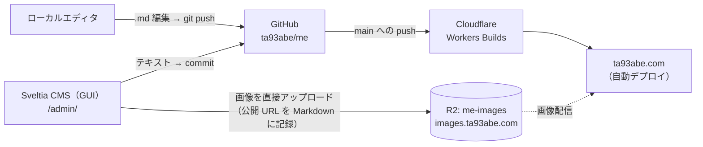

# Sveltia CMS 導入ガイド

このサイト（Astro + Content Collections + Cloudflare Workers）に [Sveltia CMS](https://sveltiacms.app/) を導入し、
**「ローカルエディタでも、ブラウザの管理画面でも書ける。画像は R2 にホストされる」** 体制を作るためのガイド。

## 全体像



- **真のソースは Git**。GUI で書いてもローカルで書いても、同じ `src/content/**/*.md` に収束する
- 同期処理は存在しない（双方向同期の競合問題が原理的に発生しない）
- 画像だけは R2 に保存され、Markdown には公開 URL が書き込まれる

### 変わらないもの

- Content Collections のスキーマ（`src/content.config.ts`）はそのまま
- ローカルで Markdown を書いて `gt create` / push するフローはそのまま
- works / books の `coverImage: image()`（Astro ビルド時最適化）はそのまま

### 新しく増えるもの

| 追加物 | 場所 |
|---|---|
| 管理画面ページ | `public/admin/index.html` |
| CMS 設定 | `public/admin/config.yml` |
| 管理画面用 CSP | `public/_headers`（`/admin/*` セクション） |
| OAuth プロキシ | `infra/sveltia-cms-auth/index.js`（公式実装を vendoring、`sveltia-auth.ta93abe.com` で配信） |
| 画像バケット | R2 `me-images`（公開 URL: `images.ta93abe.com`） |
| インフラ定義 | `infra/alchemy.run.ts`（Alchemy v2 で R2 / auth Worker をコード管理） |
| 自動デプロイ | 既存の Cloudflare Workers Builds（main への push で自動ビルド・デプロイ） |

---

## Step 1: 管理画面ページの設置

**実装済み**: `public/admin/index.html`。Sveltia は CDN から読み込む 1 スクリプトで動く
（ビルドプロセスへの統合は不要。`public/` 配下なのでそのまま `dist/` に配信される）。
バージョン固定 + SRI で読み込んでいる（下記参照）。

設定ファイルはデフォルトで同階層の `/admin/config.yml` が読まれる（Decap CMS と同じ規約）。
別の場所に置く場合は `<link href="..." type="application/yaml" rel="cms-config-url" />` で指定できる。

> `meta name="robots" content="noindex"` を忘れない。管理画面が検索結果に出るのを防ぐ。

### CDN 読み込みのセキュリティ（SRI）

上記のバージョン未指定 URL は常に最新版を配信するため、CDN 側が侵害された場合のリスクがある。
管理画面は GitHub への書き込み権限を持つページなので、本番では次のいずれかを推奨する:

- **バージョン固定 + SRI**: `https://unpkg.com/@sveltia/cms@x.y.z/dist/sveltia-cms.js` のように
  バージョンを固定し、`integrity="sha384-..." crossorigin="anonymous"` を付与する
  （ハッシュは `curl -s <URL> | openssl dgst -sha384 -binary | openssl base64 -A` で生成）。
  アップデート時はバージョンとハッシュを揃えて更新する
- **セルフホスト**: `pnpm add @sveltia/cms` して `node_modules/@sveltia/cms/dist/sveltia-cms.js` を
  `public/admin/` にコピーする（CDN 依存がなくなり、更新は pnpm 管理になる）

## Step 2: GitHub 認証（sveltia-cms-auth）

Sveltia が GitHub にコミットするための OAuth プロキシを Cloudflare Workers にデプロイする。
クライアントシークレットをブラウザに晒さないためのサーバーサイド実装で、公式リポジトリが用意されている。

**リポジトリ**: https://github.com/sveltia/sveltia-cms-auth
（`infra/sveltia-cms-auth/index.js` に vendoring 済み。デプロイは Alchemy が行う）

1. **GitHub OAuth App の作成**（手作業）
   - https://github.com/settings/applications/new
   - Authorization callback URL: `https://sveltia-auth.ta93abe.com/callback`
   - Client ID と Client Secret を控える

2. **Worker のデプロイ**
   - `GITHUB_CLIENT_ID` / `GITHUB_CLIENT_SECRET` を環境変数で渡して `pnpm infra:deploy`
   - `ALLOWED_DOMAINS=ta93abe.com` は `infra/alchemy.run.ts` に定義済み
   - Worker は `https://sveltia-auth.ta93abe.com` で配信される（`config.yml` の `base_url` と一致）

## Step 3: R2 メディアライブラリ

画像を Git リポジトリではなく R2 に保存する設定。Sveltia は R2 をネイティブサポートしている。

1. **バケット作成**: `me-images`（`infra/alchemy.run.ts` で定義済み。`pnpm infra:deploy` で作成される）

2. **公開アクセスの設定**（Alchemy で定義済み）
   - R2 の S3 API は常に認証必須のため、閲覧用に別途 `public_url` が必要
   - カスタムドメイン `images.ta93abe.com` をバケットに接続する
     （`domains` プロパティで宣言済み。ta93abe.com ゾーンから自動推論される）

3. **R2 API トークンの作成**（手作業）
   - R2 は Cloudflare のグローバル API キーとは別の独自トークンシステムを使う
   - ダッシュボードから **Object Read & Write** 権限で、`me-images` にスコープを絞って作成
   - **Access Key ID** → `config.yml` の `access_key_id` に書く（公開されて良い値）
   - **Secret Access Key** → `config.yml` には書かない。**初回利用時に CMS の UI で入力**し、
     ブラウザの localStorage に保存される仕組み

4. **CORS の設定**（Alchemy で定義済み）
   - Sveltia は AWS Signature v4 のカスタムヘッダー付きでアップロードするため、
     プリフライトリクエストを許可する CORS 設定がバケットに必要
   - `infra/alchemy.run.ts` の `cors` プロパティで
     `https://ta93abe.com` / `http://localhost:4321` からの GET / PUT / HEAD を許可している

## インフラのコード化（Alchemy v2）

Step 2 の Worker デプロイと Step 3 のバケット作成は、ダッシュボード操作の代わりに
[Alchemy v2](https://v2.alchemy.run/)（TypeScript ネイティブな IaC、Effect ベース）でコード管理する。

```
infra/
├── alchemy.run.ts          # スタック定義（実装済み）
└── sveltia-cms-auth/       # OAuth プロキシのソース（公式リポジトリから vendoring 済み）
    └── index.js
```

スタック定義は `infra/alchemy.run.ts` を参照。ポイント:

- R2 バケットは `name: "me-images"` で明示命名し、カスタムドメイン
  （`images.ta93abe.com`）と CORS 設定も Alchemy で宣言する
  （Step 3-2 / 3-4 のダッシュボード操作は不要）
- auth Worker は `domain: "sveltia-auth.ta93abe.com"` で配信し、
  `GITHUB_CLIENT_ID`（plain）/ `GITHUB_CLIENT_SECRET`（`Config.redacted` → secret_text）を
  デプロイ時の環境変数から注入する

デプロイ・破棄は CLI から（初回は Cloudflare へのインタラクティブログインあり）:

```bash
pnpm infra:plan      # 変更内容のプレビュー
pnpm infra:deploy    # alchemy deploy infra/alchemy.run.ts --stage prod
```

### 手作業として残るもの

| 作業 | 理由 |
|---|---|
| GitHub OAuth App の作成 | GitHub 側のリソースのため（Client ID/Secret を取得してデプロイ時の環境変数で渡す） |
| R2 API トークンの発行 | Sveltia がブラウザから直接 R2 に書き込むための認証情報（Step 3-3）。取得した Access Key ID を `config.yml` に反映する |
| Secret Access Key の入力 | 設計上、CMS の UI から入力する（localStorage 保存） |

### 将来の拡張

サイト本体（現在は `wrangler.jsonc` + `wrangler deploy`）も `Cloudflare.Vite("Site")` で
Alchemy に寄せられる（Astro は Vite 経由でビルドされ、静的 / SSR どちらも 1 宣言）。
まずは新規インフラ（R2 + auth Worker）だけ Alchemy 管理にし、本体の移行は別途判断する。

## Step 4: CMS 設定（config.yml）

**実装済み**: `public/admin/config.yml`。まずは blog コレクションのみで開始する
（フィールドは `src/content.config.ts` の blog スキーマと 1:1 対応）。

- `base_url`: `https://sveltia-auth.ta93abe.com`（Step 2 の Worker）
- `media_libraries.cloudflare_r2`: `me-images` バケット + `images.ta93abe.com`
- `access_key_id` のみプレースホルダー。R2 API トークン発行後（Step 3-3）に置き換える

### 注意点

- **MDX**: `extension: md` のため、既存の `.mdx` 記事（`mdx-demo.mdx` など）は
  この管理画面には表示されない。MDX はコンポーネントを含むためローカル編集のままとする
- **コミット先**: GUI での保存は `main` に直接コミットされる（PR を経由しない）。
  Graphite のスタックフローとは独立した「コンテンツ専用の直コミット」と割り切る
- **拡張**: 運用が回り始めたら works / books / talks を順次コレクション追加する。
  works / books は `coverImage: image()`（ローカル画像必須）なので、
  R2 参照に変える場合はスキーマを `z.string().url()` に変更する判断が必要

## Step 5: 自動デプロイ

**このリポジトリでは対応済み。** サイト本体は Cloudflare Workers Builds に接続されており、
main への push（GUI からのコミットを含む）で自動的にビルド・デプロイされる。
GitHub Actions のデプロイワークフローを追加する必要はない。

- ビルド状況は Cloudflare ダッシュボード → Workers & Pages → `me` → Builds で確認できる
- PostHog 等のビルド時変数は Workers Builds の「Build variables and secrets」に登録する
  （`.env.example` 参照）

## ローカル開発ワークフロー

Sveltia には OAuth 不要の **ローカルリポジトリモード** がある。
デプロイ前でも管理画面の使い勝手を試せる。

1. `pnpm dev` を起動
2. Chromium 系ブラウザ（Chrome / Edge / Brave）で `http://localhost:4321/admin/` を開く
   （File System Access API 依存のため Firefox / Safari 不可。Brave はフラグで有効化が必要）
3. 「Work with Local Repository」を選び、プロジェクトフォルダを指定
4. 保存するとローカルの `.md` ファイルが直接書き換わる → 確認して自分で commit / push

## 移行チェックリスト

- [x] `public/admin/index.html` を作成（バージョン固定 + SRI）
- [x] `public/_headers` に `/admin/*` 用の CSP / noindex を追加
- [x] `public/admin/config.yml` を作成（blog コレクション）
- [x] `infra/alchemy.run.ts` で R2 バケット + sveltia-cms-auth Worker を定義
      （カスタムドメイン・CORS 込み）
- [x] 自動デプロイ: 既存の Workers Builds で対応済み（追加作業なし）
- [ ] GitHub OAuth App 作成（callback: `https://sveltia-auth.ta93abe.com/callback`、
      Client ID / Secret を取得）
- [ ] `GITHUB_CLIENT_ID` / `GITHUB_CLIENT_SECRET` を渡して `pnpm infra:deploy`
- [ ] R2 API トークン作成（Object Read & Write / `me-images` スコープ）、
      Access Key ID を `config.yml` の `access_key_id` に反映
- [ ] ローカルリポジトリモードで動作確認
- [ ] デプロイ後、`https://ta93abe.com/admin/` から GitHub ログイン → 記事作成 → 自動デプロイまで通し確認
- [ ] （任意）works / books / talks のコレクション追加を検討

## トラブルシューティング

| 症状 | 原因と対処 |
|---|---|
| 画像アップロードが失敗する | R2 バケットの CORS 未設定。Step 3-4 を確認 |
| 画像プレビューが表示されない | `public_url` 未設定または間違い。S3 エンドポイントは閲覧に使えない |
| ログインできない | OAuth App の callback URL が `https://sveltia-auth.ta93abe.com/callback` になっているか、`ALLOWED_DOMAINS` にドメインが含まれるか確認 |
| GUI で保存したのに反映されない | Workers Builds が動いているか Cloudflare ダッシュボードのビルドログを確認 |
| 管理画面でリソースがブロックされる | `public/_headers` の `/admin/*` CSP に必要なオリジンが含まれるか確認 |
| 記事一覧に .mdx が出ない | 仕様（`extension: md`）。MDX はローカル編集で扱う |
| ローカルモードのボタンが出ない | Chromium 系ブラウザか確認。Brave は `brave://flags/#file-system-access-api` を有効化 |

## 参考リンク

- [Sveltia CMS ドキュメント](https://sveltiacms.app/en/docs/intro)
- [Astro との統合](https://sveltiacms.app/en/docs/frameworks/astro)
- [Cloudflare R2 メディアライブラリ](https://sveltiacms.app/en/docs/media/cloudflare-r2)
- [ローカル開発ワークフロー](https://sveltiacms.app/en/docs/workflows/local)
- [sveltia-cms-auth（OAuth プロキシ）](https://github.com/sveltia/sveltia-cms-auth)
- [Netlify/Decap CMS からの移行](https://sveltiacms.app/en/docs/migration/netlify-decap-cms)
